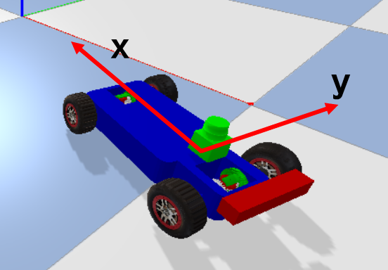
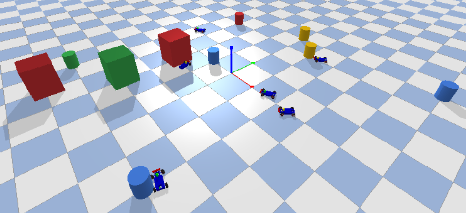

# Multi-robot simulation based on pybullet

## Requirements

* [pybullet](https://github.com/bulletphysics/bullet3)
```bash
pip install pybullet
```
* [informer](https://github.com/IamWangYunKai/informer)
```bash
git clone https://github.com/IamWangYunKai/informer
cd informer
python setup.py install
```

## Run
```bash
bash test.bash
```

## Others
* Robot and its coordinate

* Running demo


## TODO
- [ ] route plan
- [ ] motion control
- [ ] multi-agent collaboration
